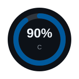
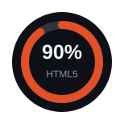
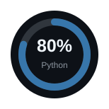
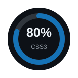
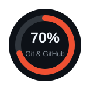
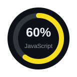
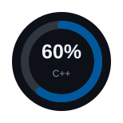
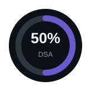
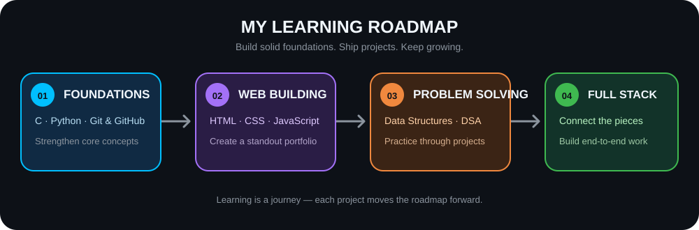

<!-- Profile README for priyajitpaul4-cmyk -->

  

  <h3>💻 C &amp; Python Programmer &nbsp;•&nbsp; 🌐 Web Development Enthusiast &nbsp;•&nbsp; 🚀 Aspiring Full-Stack Developer</h3>

  
  
  

---

## 👋 About Me

> I am a **Computer Science &amp; Technology student** who enjoys turning ideas into practical projects and learning by building.

- 🔭 **Currently building:** my personal portfolio website
- 🌱 **Learning path:** C, Python, HTML, CSS, JavaScript, Git &amp; GitHub, and DSA
- 💻 **What I enjoy:** programming fundamentals, problem-solving, and web development
- 🤝 **Open to:** beginner-friendly C, Python, and web development collaborations
- 💬 **Ask me about:** C, Python, web development, and GitHub projects
- ⚡ **My approach:** learn, build, reflect, repeat

---

## 🧰 Tech Stack

| Programming | Web Development | Tools &amp; Technologies |
| :---: | :---: | :---: |
|  |  |  |
| C · Python · C++ | HTML5 · CSS3 · JavaScript | Git · GitHub · Node.js · MySQL · SQLite |

---

## 📊 Skill Progress

**A circular view of my current learning journey.**

<table>
  <tr>
    <td align="center"></td>
    <td align="center"></td>
    <td align="center"></td>
    <td align="center"></td>
  </tr>
  <tr>
    <td align="center"></td>
    <td align="center"></td>
    <td align="center"></td>
    <td align="center"></td>
  </tr>
</table>

> 📌 These percentages reflect my current learning stage and will evolve as I build more projects.

---

## 🗺️ Roadmap

  

| ✨ Milestone | 🎯 Next move |
| :-- | :-- |
|  | Strengthen C and Python fundamentals while using Git &amp; GitHub consistently. |
|  | Complete a responsive portfolio and sharpen HTML, CSS, and JavaScript through hands-on work. |
|  | Practice DSA alongside projects to develop stronger logical thinking. |
|  | Bring front-end and back-end learning together through end-to-end projects. |

---

## 🚀 Featured Projects

  Small projects, practical learning, and one step closer to the next milestone.

<table>
  <tr>
    <td width="50%" valign="top">
      <h3>🌐 Personal Portfolio</h3>
      
      
A responsive portfolio website that shares my skills, projects, and development journey.

      

        
        
        
      

    </td>
    <td width="50%" valign="top">
      <h3>🔐 Random Password Generator</h3>
      
      
A Python project for creating secure random passwords through a simple interface.

      

    </td>
  </tr>
  <tr>
    <td width="50%" valign="top">
      <h3>🌦️ Weather Application</h3>
      
      
An application designed to display weather information using APIs.

      
 

    </td>
    <td width="50%" valign="top">
      <h3>💻 C Programming Projects</h3>
      
      
A collection of C exercises and projects focused on programming fundamentals and problem-solving.

      

    </td>
  </tr>
</table>

  

---
<!-- Professional Contact & Fun Fact Section -->

  

    <i class="fas fa-address-card"></i> connect
    
    <a href="mailto:priyajitpaul4@gmail.com" class="contact-item">
      <i class="fas fa-envelope"></i> priyajitpaul4
    </a>
    <a href="https://github.com/priyajitpaul4-cmyk" target="_blank" class="contact-item">
      <i class="fab fa-github"></i> priyajitpaul4-cmyk
    </a>
    <a href="https://linkedin.com/in/priyajit-paul-217129417" target="_blank" class="contact-item">
      <i class="fab fa-linkedin-in"></i> priyajit-paul
    </a>
    <a href="https://instagram.com/pauls_art_21" target="_blank" class="contact-item">
      <i class="fab fa-instagram"></i> pauls_art_21
    </a>
    <a href="https://facebook.com/pauls_art_21" target="_blank" class="contact-item">
      <i class="fab fa-facebook-f"></i> pauls_art_21
    </a>
  

  

    

      <i class="fas fa-lightbulb"></i> 
      ⌨️  first code: "Hello, World!"
      <button class="refresh-fact" id="newFactBtn" title="new fun fact">
        <i class="fas fa-arrows-rotate"></i>
      </button>
    

  

<!-- CSS Styles -->

<!-- JavaScript for Random Fun Fact -->

  Thanks for visiting — feel free to explore my projects or connect with me on GitHub. ✨

